# BrewTrackr

A responsive web application that pulls data from FourSquare API and allows users to search for coffee or breweries in any city. The app allows users to keep track of their favorite brew places.

## Introduction
BrewTrackr is a coffee/breweries tracking app that goes above and beyond a simple search app. The app allows users to create an account and keep track of their favorite coffee and breweries. BrewTrackr will allow users to save any brew place and write/edit their own reviews on each place. Keep track of all your favorite coffee/breweries and write your own reviews/comments with BrewTrackr! Create an account and get started.

## Live Demo
You can find the live demo of TrekCheck at: 
https://obscure-scrubland-61538.herokuapp.com/

## Screenshots
Start Display Page
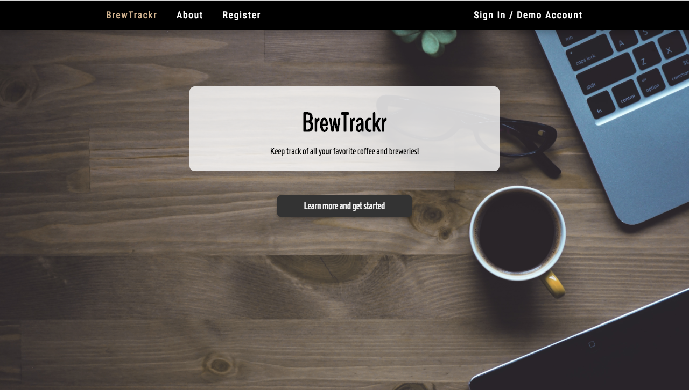
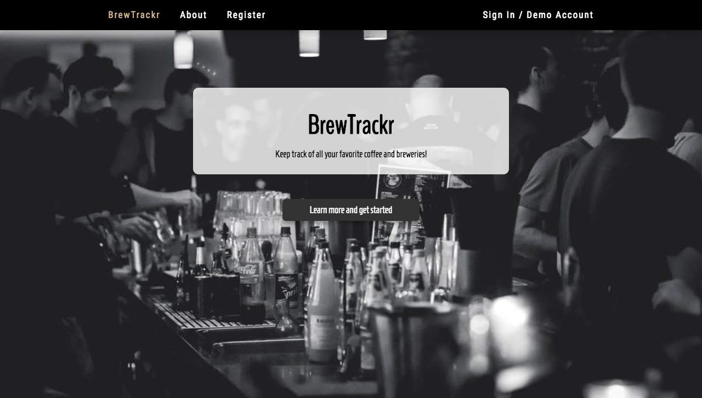
## About Section
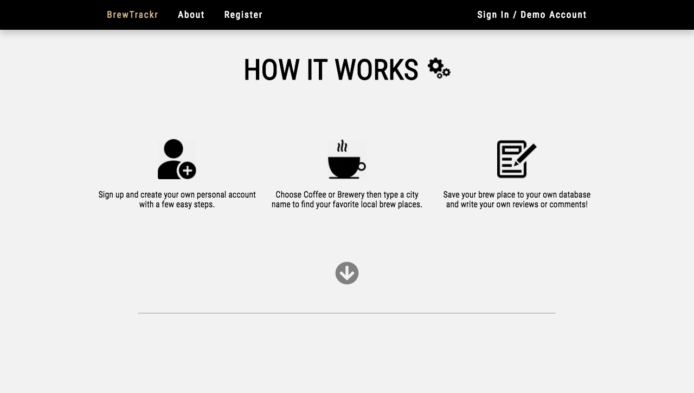
## Register Section
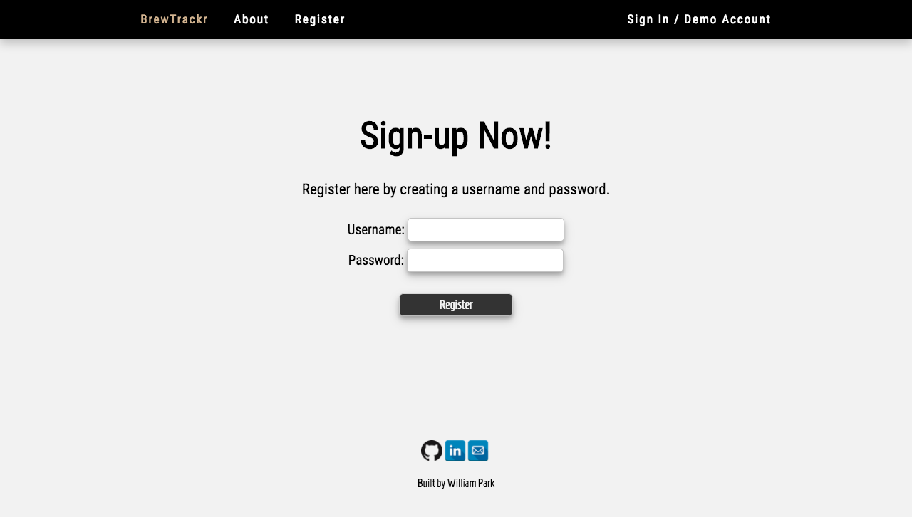
## SignIn Page
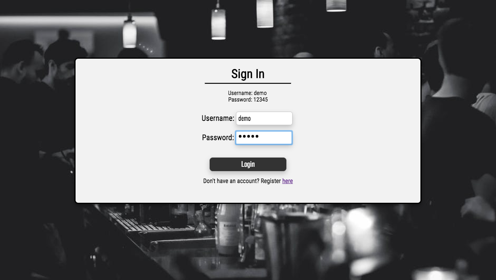
## Coffee List Page
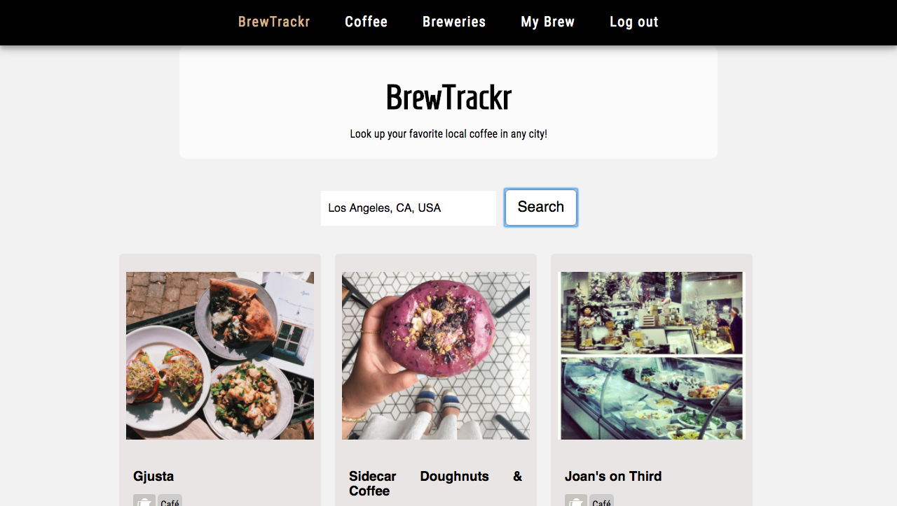
## Brew List Page
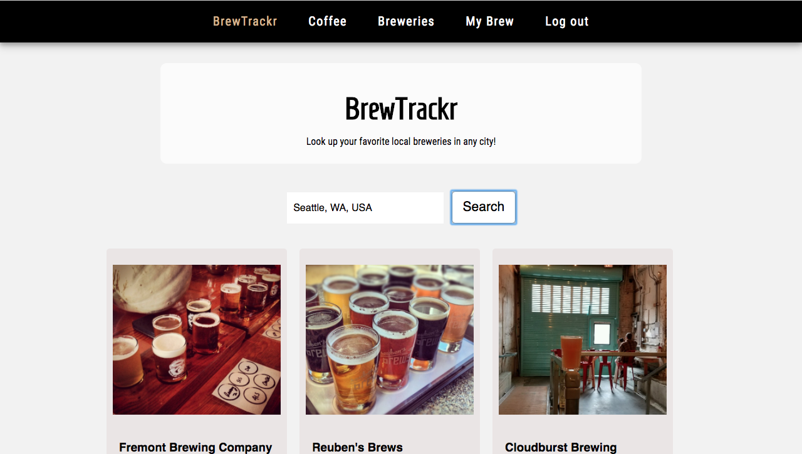
## Save Brew Page
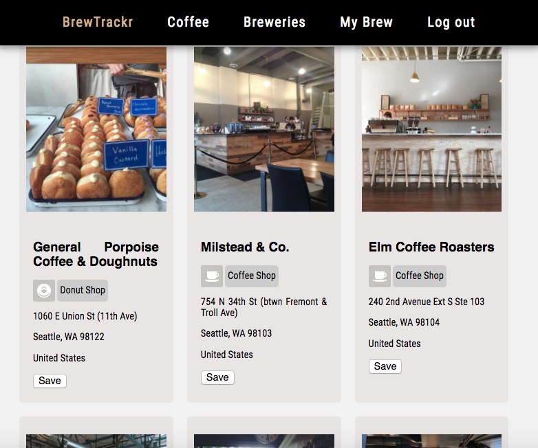
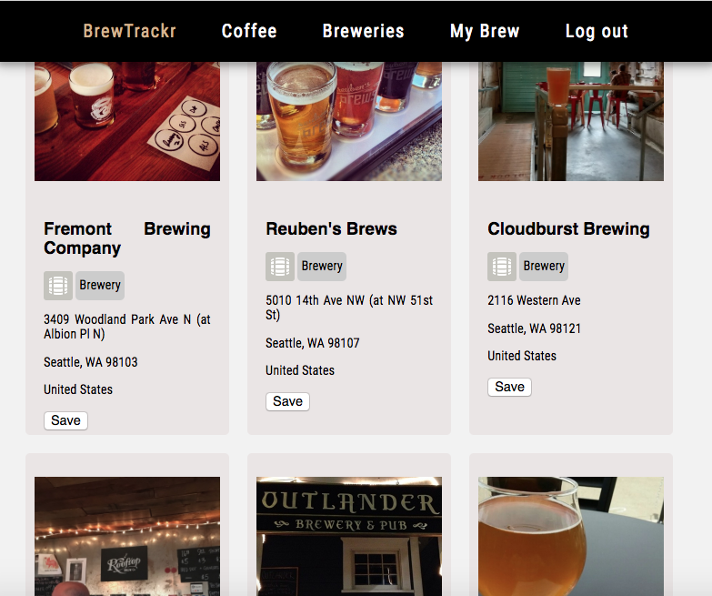
## Brew List Page
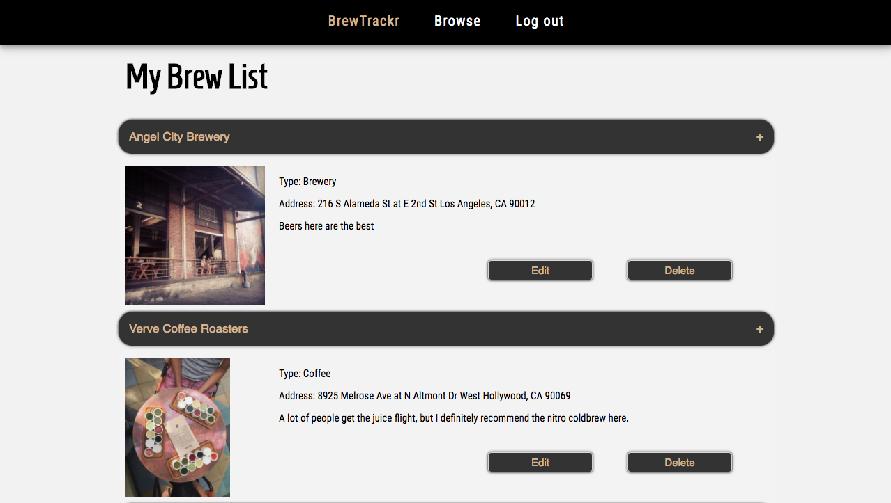
## Edit Page
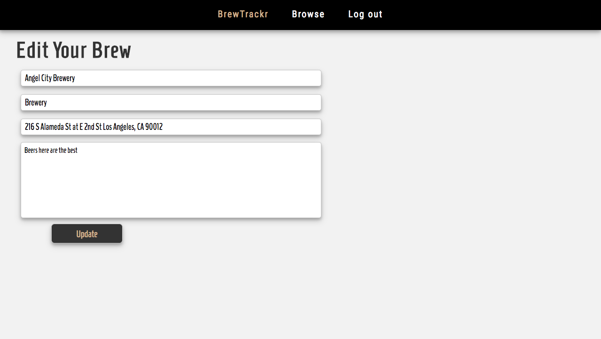

## Technology

##Front End
<li> HTML5  
<li> CSS3  
<li> JavaScript  
<li> jQuery  

##BackEnd
<li> Node.js  
<li> Express.js  
<li> MongoDB  
<li> Mongoose 

##Security and Authentication
<li> Passport.js  
<li> bcrypt.js  
<li> JSON Web Token 

##Deployment, Version Control and Cloud Hosting
<li> GitHub  
<li> Heroku  
<li> mLab 

